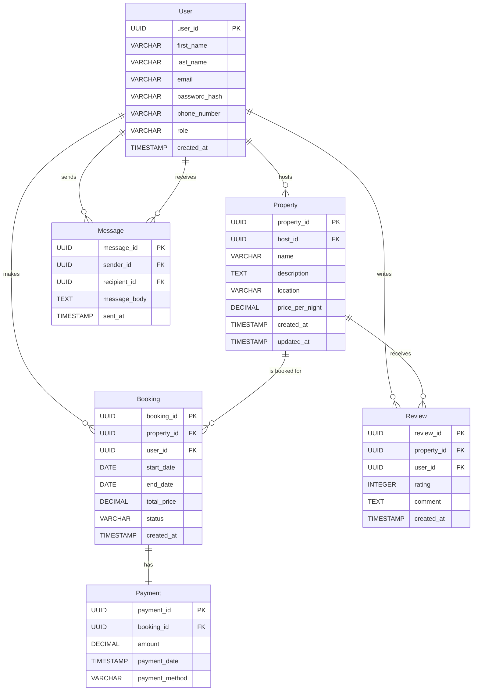

# 🏠 AirBnB Database ER Diagram

This Entity-Relationship Diagram (ERD) represents the core structure of an **AirBnB-style platform** — showing relationships among `User`, `Property`, `Booking`, `Payment`, `Review`, and `Message` entities.

