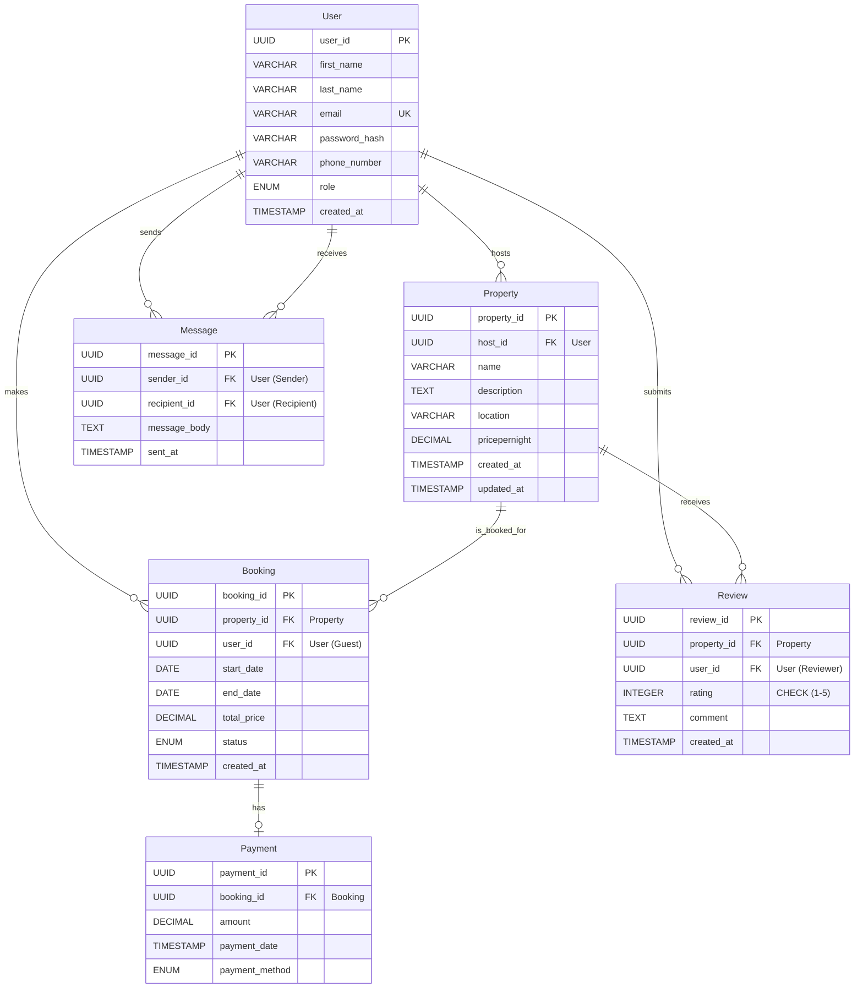

```mermaid
    erDiagram
    %% --- Relationship Definitions (Cardinality) ---
    %% One User (Host) hosts Zero-to-Many Properties
    User ||--o{ Property : hosts
    
    %% One User (Guest) makes Zero-to-Many Bookings
    User ||--o{ Booking : makes

    %% One Property is booked for Zero-to-Many Bookings
    Property ||--o{ Booking : is_booked_for

    %% One Booking Has Exactly One Payment
    Booking ||--o| Payment : has

    %% One User submits Zero-to-Many Reviews
    User ||--o{ Review : submits

    %% One Property receives Zero-to-Many Reviews
    Property ||--o{ Review : receives

    %% One User sends Zero-to-Many Messages
    User ||--o{ Message : sends

    %% One User receives Zero-to-Many Messages
    User ||--o{ Message : receives

    %% --- Entity Definitions with Attributes ---

    User {
        UUID user_id PK
        VARCHAR first_name
        VARCHAR last_name
        VARCHAR email UK
        VARCHAR password_hash
        VARCHAR phone_number
        ENUM role
        TIMESTAMP created_at
    }

    Property {
        UUID property_id PK
        UUID host_id FK "User"
        VARCHAR name
        TEXT description
        VARCHAR location
        DECIMAL pricepernight
        TIMESTAMP created_at
        TIMESTAMP updated_at
    }

    Booking {
        UUID booking_id PK
        UUID property_id FK "Property"
        UUID user_id FK "User (Guest)"
        DATE start_date
        DATE end_date
        DECIMAL total_price
        ENUM status
        TIMESTAMP created_at
    }

    Payment {
        UUID payment_id PK
        UUID booking_id FK "Booking"
        DECIMAL amount
        TIMESTAMP payment_date
        ENUM payment_method
    }

    Review {
        UUID review_id PK
        UUID property_id FK "Property"
        UUID user_id FK "User (Reviewer)"
        INTEGER rating "CHECK (1-5)"
        TEXT comment
        TIMESTAMP created_at
    }

    Message {
        UUID message_id PK
        UUID sender_id FK "User (Sender)"
        UUID recipient_id FK "User (Recipient)"
        TEXT message_body
        TIMESTAMP sent_at
    }


```

